# CIS 343 Scanner Lab 1

Language Name: PLox

## Regular Expression:

Number: `[0-9]+(\.[0-9]+)?`

String: `"[^"]*"`

Identifier: `[A-Za-z][A-Za-z0-9_]*`

## Design Choices Relative to Lox:

PLox retains Lox’s keywords, operators, punctuation, double-quoted strings, and // style commenting. Keeping these rules makes the scanner straightforward to implement and test while learning how programing languages are built and work.

Like Lox, Rock supports whole-number and decimal literals, storing their values as floating-point numbers. Whitespace and comments are ignored, and an EOF token marks the end of input.

PLox differs from Lox by not allowing underscores to start an identifier.

Lexical errors, including unexpected characters and unterminated strings, report a line number. Interactive mode remains available after an error.

## Dependency/setup instructions

The only dependencies for this lab is a Python version 3.10 or newer.

To ensure project is ready to run, call python --version to ensure correct version dependency.

## Scanner Commands

Interactive mode in terminal:

From src directory: python plox.py

To run on a file:

From src directory: python plox.py filename

Lab1 test files:

Run from src: python plox.py ../test/lab1/filename

## Known Limitations:

- Strings do not support escape sequences such as \\" or \\n.

- Only // line comments are supported; block comments (/\* ... \*/) are not supported.

- Numbers do not support scientific notation, such as 1e3. Decimal literals require digits on both sides of the decimal point.

- Identifiers use ASCII letters and cannot begin with an underscore.

- Error messages include line numbers but not column positions.

- Numeric literals are stored as Python floating-point values, so very large numbers may lose precision or become infinity.

## Testing:

### All Token Testing:

File name: all\_tokens.plx

Comment: All test show pass showing that scanner correctly parses grammer.

The purpose of this test is to ensure that all tokens when passed through the scanner output correctly. The token tested and expected are as follows:

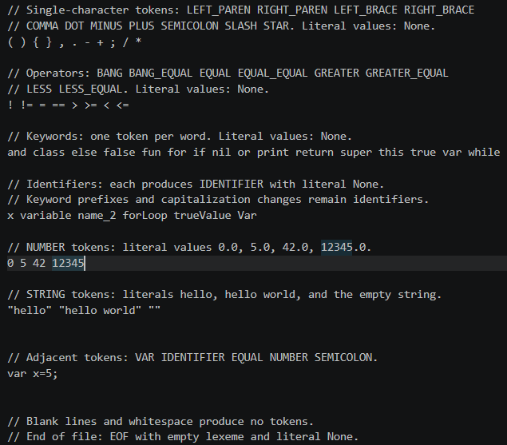

Output:

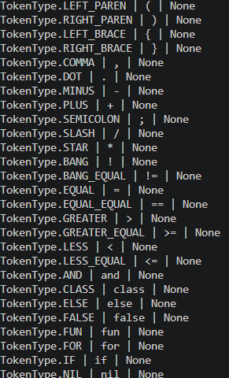

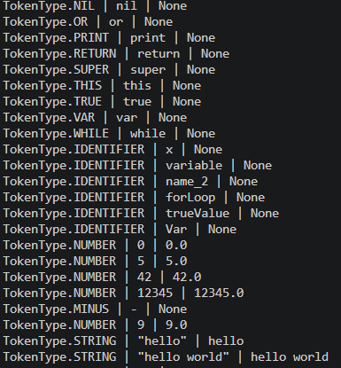

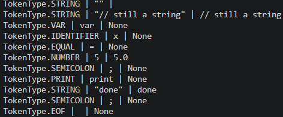

### String Edge Cases:

File name: string\_edge.plx

Comment: 

All string esge cases pass. Even when we write a string inside of a comment we do not tokenize it. We do not add commnent into token after a string, we add an empty string token, and even a //comment is inside of string it counts as a string. Even enexpected characters inside of a string return as a string. 

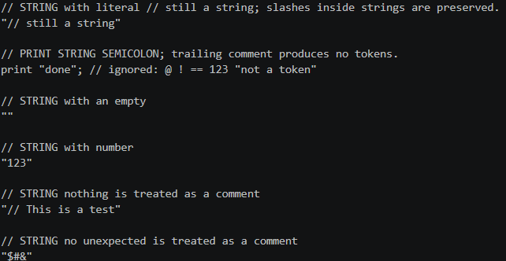

Output:

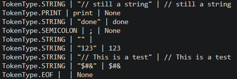

### Number Edge cases:

File name: number\_edge.plx

Comments:

All number edge cases pass. When we input a negative number is this is split as two tokens, leading zeros are not added to the number value, dots are counted as seperate tokens if not fallowed by and leading by a number, and a number fallowed by and identifer with no space is still seperate tokens.

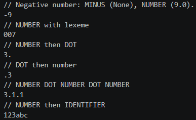

Output:

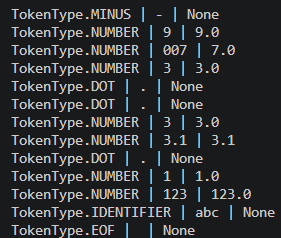

### Literal edge cases:

Comments:

All literal edge tests pass. Even when we lead with a keyword name if there is not a space between the keyword and a identifier, then it is just an identifier.

File name: literal\_edge.plx

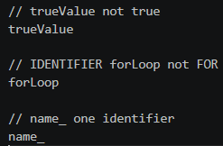

Output:

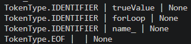

### Comment edge cases:

Comments:

All comment edge cases pass. When we we have error in a comment we still return a comment and comments leading after tokens are ignored.

File name: comments\_edge.plx

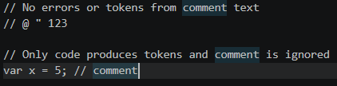

Outputs:

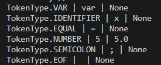

### Error cases:

Unexpected String error: “

Output:

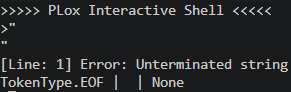

Unexpected-character error: ²

Output:

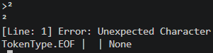

Error for \_ before indetifier: \_name

Output:

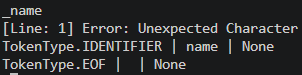

Unexpected-character under ASCII rules: é

Output:

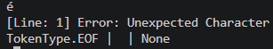

Multi-line code displays Error on correct line number: Error on line 3

File name: error\_line\_test.plx

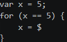

Output:

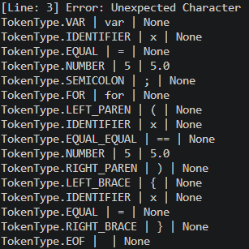
